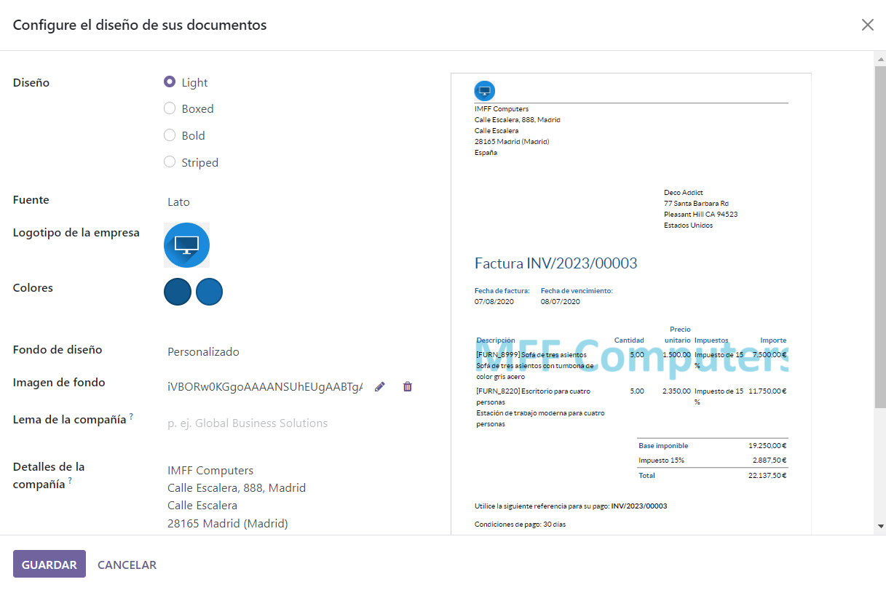

## [Unidad 3](../index.md)
# Practica 1
1. Lo primero que hacemos es levantar el servidor de odoo en mi docker e instalar el modulo de facturacion.

---

2. Una vez se haya instalado accedo a el y empezamos a introducir los datos de nuestra "empresa", que nos inventamos todos los datos menos el nombre que en mi caso es "IMFF Computers"

---

3. Creamos un nuevo usuario que solo puede acceder al modulo de **Facturación**, en mi caso lo he llamada "Usuario_Facturas", con un correo que se llama "usu_fac@gmail.com" y con permisos de "Facturacion"

---

4. Lo siguiente que tenemos que hacer es configurar las facturas, primero vamos a ajustes y activamos la casilla que dice "Codigos QR", despues vamos al modulo de facturas y entramos en "Editar diseño" para cambiar el diseño de las facturas, cambiamos los colores, agregamos un logo y una imagen para el fondo

---

5. Importamos los clientes con un archivo clientes.csv y configuramos para que nos detecte los campos correctamente ya que al intentarlo por primera vez hay unos campos que no detecta como "Nombre y apellidos" que le asignamos nombre, o ciudad y localidad que asignamos en ambos ciudad y asi nos lo concatena y el telefono fijo que ponemos "Telefono".

---

6. Iniciamos sesion con el usuario de facturas y creamos una factura a un cliente con unos productos y generamos la [Factura](./Archivos/INV-2024-00005.pdf)

---