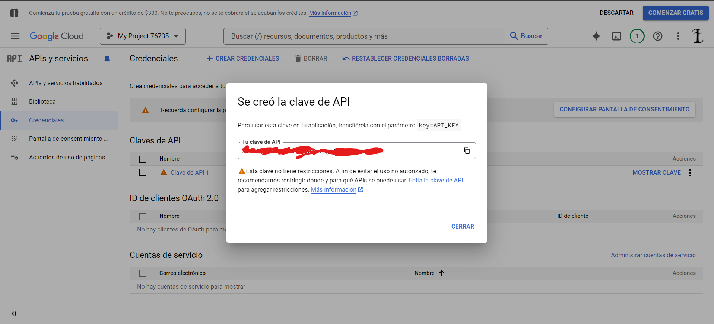
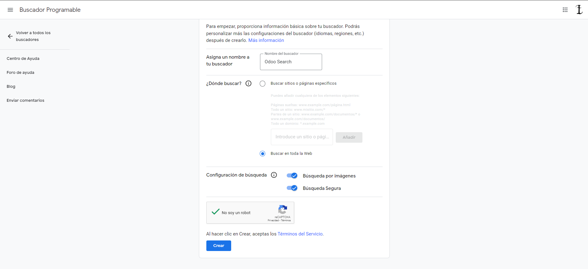
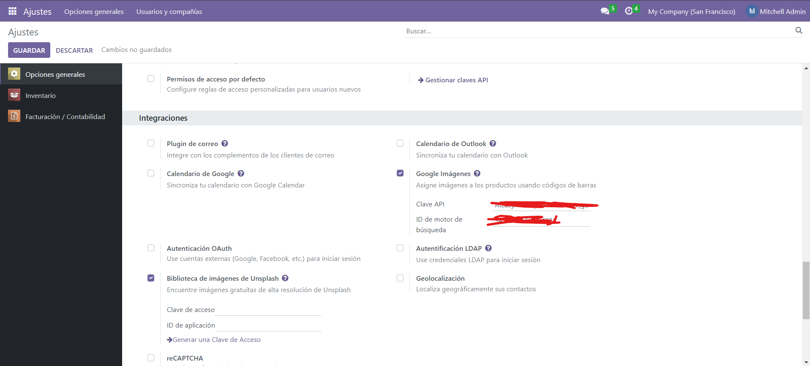

## [Unidad 3](../index.md)
# Practica 2

1. Lo primero que debemos hacer es activar el módulo de "*Inventario*" 

2. A continuacion tenemos que importar los productos con el archivo libros.xsl, rellenando los campos con la correspondencia, este caso solo debemos guardar el titulo, precio y EAN.

3. Despues de importar los productos como no tienen imagenes, las conseguiremos desde Google Custom Search API mediante el codigo EAN. Lo primero es conseguir la API Key y despues crear y configurar el motor de busqueda para luego configurar Odoo y que lo utilice

    3.1 Lo primero es entrar en la pagina [Google API'S Y SERVICIOS](https://console.cloud.google.com/apis/credentials?project=encoded-might-437607-b2&supportedpurview=project) y obtener la credencial creando una clave api
    
    
    
    3.2 Despues entramos en biblioteca y buscamos *Custom Search API* y lo habilitamos
    

    3.3 A continuacion debemos crear el buscador y guardar su ID asi que entramos en [Google Programmable Search Dashboard](https://programmablesearchengine.google.com)

    
    

    3.4 Por ultimo debemos entrar en las configuraciones de Odoo, en el apartado de "*Integraciones*" y activar obtener imagenes de google y recargar la pagina, acto seguido nos dejara introducir el ID del buscardor y la clave de la API

    

4. Una vez creado y configurado todo solo debemos entrar en un producto, abrir el desplegable de *Acción* y seleccionar *Obtener imagen* y si todo esta bien le estableceria una imagen automaticamente

