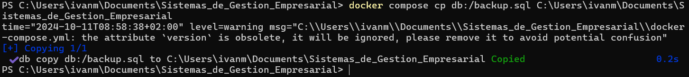
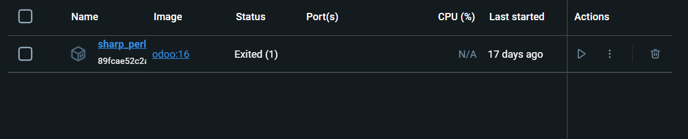
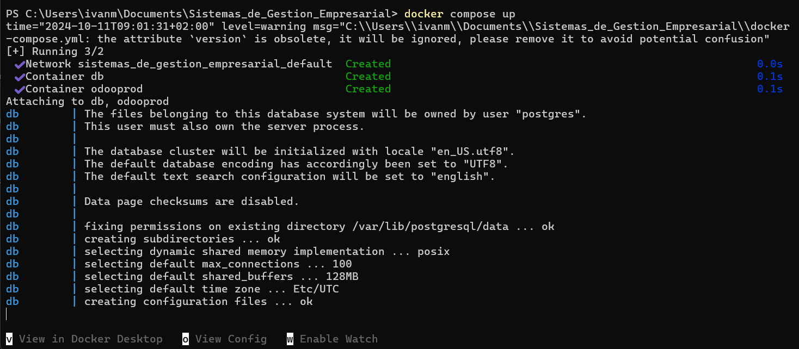
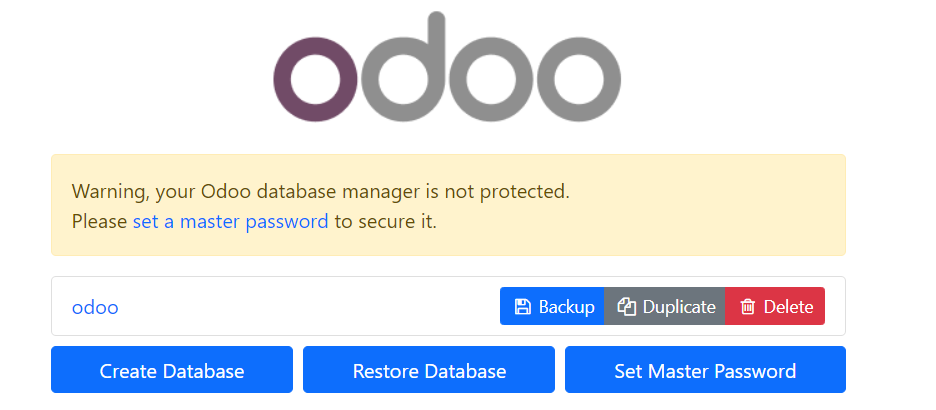

## [Unidad 3](../index.md)
# Practica 3

### Ejercicio1
#### Parte 1
1. Lo primero que tenemos que hacer para hacer la copia de seguridad desde el terminal es conectarnos a la base de datos con el siguiente comando:

2. Acontinuacion creamos la copia de seguridad de la base de datos odoo, con el usuario responsable que en mi caso tambien se llama odoo y lo vocamos en un archivo con extension .sql:

3. Una vez creada la copia lo siguiente es apagar el contenedor y copiar el archivo del contenedor a la maquina fisica, o en donde la queramos guardar, para esto ejecutamos el siguiente comando:

4. Una vez tenemos el archivo .sql vamos a probar a borrar todo y restaurarlo con la copia para comprobar que ha funcionado a la perfección, debemos borrar los contenedores y el contenido de nuestras carpetas que tenemos enlazadas a los contenedores.

5. Despues de borrar todo tenemos que volver a crear los contenedores y levantarlos, en mi caso hare uso de mi archivo "docker-compose.yml" usando el comando "docker compose up":

Acto seguido debemos iniciar odoo en nuestro navegador y configurar todo igual que antes.

6. Con los contenedores ya creados, levantados y configurados lo siguiente que debemos hacer es crear la base de datos pero vacia, para ello nos conectamos al contenedor por terminal y ejecutamos el siguiente comando:

Especificando que el usuario que usaremos en ella se llama odoo y que la base de datos se llama odoo.

7. Para restaurar la copia de seguridad e introducir de nuevo los datos en la base de datos que acabamos de crear necesitamos salir del contenedor y copiar el archivo .sql de nuevo al contenedor:

Especificando la ruta absoluta donde lo queremos pegar

8. Volvemos a entrar dentro del contenedor por terminal y restauramos la base de datos con el siguiente comando:

9. Una vez realizado todo esto, si volvemos a entrar en odoo todo deberia de estar tal y como estaba antes

#### Parte 2
1. Para realizar la copia de seguridad mediante interfaz grafica debemos entrar en esta [pagina](http://localhost:8069/web/database/manager):

2. Una vez estemos en esta pagina debemos seleccionar la opcion "backup" que nos saldra el siguiente menu:

En este menu debemos introducir la contraseña que elegimos al principio y que base de datos queremos crear la copia de seguridad, abajo nos sale en que tipo de archivo queremos generar la copia.

3. Despues de crear la copia se nos habra descargado un archivo comprimido .zip, este es nuestra copia de seguridad.

4. Para poder comprobar que la copia esta bien hecha repetimos los pasos anteriores y eliminamos los contenedores y el contenido de nuestras carpetas enlazadas a la base de datos, a continuacion volvemos a levantar los contenedores con "docker compose up" y volvemos a entrar en la [pagina](http://localhost:8069/web/database/manager).

En este caso al arrancar de nuevo los contenedores clicar abajo en "Restore DataBases".

5. Una vez se nos abra la ventana de restauracion debemos elegir el archivo de la copia, el nombre de la base de datos y la contraseña

Y clicamos en "Continue", se creara odoo y restaurará la base de datos y si todo esta correcto deberia estar exactamente igual a como estaba antes de eliminar todo.

