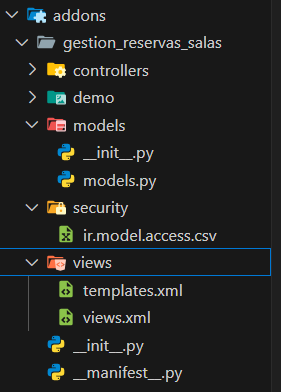

## [Unidad 5](../index.md)
# Practica 1
Lo primero que debemos hacer para crear un modulo es crear una estructura de datos determinada, para ahorrar tiempo, docker-compose nos da un comando que nos crea esta estructura automaticamente, el comando es "docker-compose scaffold nombre_modulo /mnt/extra-addons/"


Este comando nos deja esta estructura


Una vez tengamos esta estructura nos pondremos a trabajar sobre ella, modificaremos los siguientes archivos

## Archivo __manifest__.py
En este archivo debemos descomentar el codigo, despues cambiamos el nombre, el "sumary" que es una descripcion corta de 1 linea, la "description" que es una descripcion mas extensa de unas 2 o 3 lineas y el campo de "author" que ponemos nuestro nombre
```
# -*- coding: utf-8 -*-
{
    'name': "gestion_reservas_salas",

    'summary': """
        Gestin basica de reserva de salas en una empresa""",

    'description': """
        Este módulo permite gestionar reservas de salas en una empresa, 
        incluyendo información como nombre, capacidad, fecha de reserva, 
        estado de disponibilidad y comentarios. Facilita la administración 
        eficiente y evita conflictos en la asignación de espacios.
    """,

    'author': "Ivan",
    'website': "https://www.yourcompany.com",

    # Categories can be used to filter modules in modules listing
    # Check https://github.com/odoo/odoo/blob/16.0/odoo/addons/base/data/ir_module_category_data.xml
    # for the full list
    'category': 'Uncategorized',
    'version': '0.1',

    # any module necessary for this one to work correctly
    'depends': ['base'],

    # always loaded
    'data': [
        'security/ir.model.access.csv',
        'views/views.xml',
        'views/templates.xml',
    ],
    # only loaded in demonstration mode
    'demo': [
        'demo/demo.xml',
    ],
}
```

## Archivo views.xml
En este archivo debemos descomentar todo menos el modelo de accion servidor que no lo vamos a usar, introducimos los campos de informacion, que son los que queremos visualizar, al final del archivo se indican las opciones del menu y sus acciones correspondientes, la opcion "Reservas disponibles" no deberia tener ninguna accion seleccionada pero si no se le indica la accion esta opcion no aparece.
```
<odoo>
  <data>
    <!-- explicit list view definition -->

    <record model="ir.ui.view" id="gestion_reservas_salas.list">
      <field name="name">gestion_reservas_salas list</field>
      <field name="model">gestion_reservas_salas.gestion_reservas_salas</field>
      <field name="arch" type="xml">
        <tree>
          <field name="nombre"/>
          <field name="capacidad"/>
          <field name="fecha"/>
          <field name="reservada"/>
          <field name="comentarios"/>
        </tree>
      </field>
    </record>


    <!-- actions opening views on models -->

    <record model="ir.actions.act_window" id="gestion_reservas_salas.action_window">
      <field name="name">gestion_reservas_salas window</field>
      <field name="res_model">gestion_reservas_salas.gestion_reservas_salas</field>
      <field name="view_mode">tree,form</field>
    </record>


    <!-- server action to the one above -->

    <!-- <record model="ir.actions.server" id="gestion_reservas_salas.action_server">
      <field name="name">gestion_reservas_salas server</field>
      <field name="model_id" ref="model_gestion_reservas_salas_gestion_reservas_salas"/>
      <field name="state">code</field>
      <field name="code">
        action = {
          "type": "ir.actions.act_window",
          "view_mode": "tree,form",
          "res_model": model._name,
        }
      </field>
    </record> -->


    <!-- Top menu item -->

    <menuitem name="Gestión de salas" id="gestion_reservas_salas.menu_root"/>

    <!-- menu categories -->

    <menuitem name="Salas" id="gestion_reservas_salas.menu_1" parent="gestion_reservas_salas.menu_root"/>
    <menuitem name="Reservas" id="gestion_reservas_salas.menu_2" parent="gestion_reservas_salas.menu_root"/>

    <!-- actions -->

    <menuitem name="Salas Disponibles" id="gestion_reservas_salas.menu_1_list" parent="gestion_reservas_salas.menu_1"
              action="gestion_reservas_salas.action_window"/>
    <menuitem name="Reservas realizadas" id="gestion_reservas_salas" parent="gestion_reservas_salas.menu_2"
              action="gestion_reservas_salas.action_window"/>

  </data>
</odoo>
```

## Archivo models.py
En este archivo descomentamos todo hasta la linea que empieza con "@api.depends('value')". En este archivo es donde debemos introducir los campos que vamos a guardar de las salas con sus tipos de datos, en mi caso vamos a guardar:
1. Nombre que es un **char**
2. Capacidad que es un **integer**
3. Fecha que es un **date**
4. Reservada que es un **boolean**
5. Comentarios que es un **char**
```
# -*- coding: utf-8 -*-

from odoo import models, fields, api    #type:  ignore


class gestion_reservas_salas(models.Model):
    _name = 'gestion_reservas_salas.gestion_reservas_salas'
    _description = 'gestion_reservas_salas.gestion_reservas_salas'

    nombre = fields.Char()
    capacidad = fields.Integer()
    fecha = fields.Date()
    reservada = fields.Boolean()
    comentarios = fields.Char()

    # @api.depends('value')
    # def _value_pc(self):
    #     for record in self:
    #         record.value2 = float(record.value) / 100

```

## Resultado
Con estas modificaciones nos apareceria el modulo disponible en la lista de aplicaciones, si lo instalamos podemos empezar a funcionar con el.

Podemos comprobar que funciona si nos aparece el modulo en el menu principal


Si entramos en el veremos la pantalla principal en la que se visualiza los campos que introducimos anteriormente


Y podemos comprobar los 2 menus que creamos


