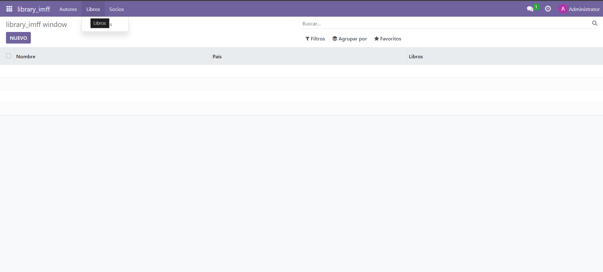

## [Unidad 6](../index.md)
# Practica 2

Para hacer este ejercicio lo unico que hay que tener en cuenta es la relaciones entre los campos.
En este caso para el modelo autores el campo pais hace referencia a un fichero que contiene los paises, como hay varios pero solo se selecciona uno ponemos una relacion Many2one y referenciamos el fichero 'res.country', al campo libros establecemos relacion One2many y por ende en el modelo libros hay un campo con relacion Many2one llamado autor. En el modelo socios hay un campo libros que es para los libros prestados, establecemos la relacion Many2many y por ende en el modelo libros hay un campo socios con relacion Many2many.


## Modelo libreria_autores.py
```
# -*- coding: utf-8 -*-

from odoo import models, fields, api    #type:  ignore


class libreria_autores(models.Model):
    _name = 'library_imff.libreria_autores'
    _description = 'library_imff.libreria_autores'

    nombre = fields.Char()
    pais = fields.Many2one(
        'res.country',
        string='Pais'
    )
    libros = fields.One2many(
        comodel_name='library_imff.libreria_libros',
        inverse_name='autor',
        string='Libros'
    )

#     @api.depends('value')
#     def _value_pc(self):
#         for record in self:
#             record.value2 = float(record.value) / 100

```

## Modelo libreria_libros.py
```
# -*- coding: utf-8 -*-

from odoo import models, fields, api    #type:  ignore


class libreria_libros(models.Model):
    _name = 'library_imff.libreria_libros'
    _description = 'library_imff.libreria_libros'

    titulo = fields.Char()
    autor = fields.Many2one(
        comodel_name='library_imff.libreria_autores',
        string='Autor'
    )
    genero = fields.Selection([
        ('novela', 'Novela'),
        ('drama', 'Drama'),
        ('ciencia ficcion', 'Ciencia Ficcion'),
        ('misterio', 'Misterio'),
        ('terror', 'Terror'),
        ('historico', 'Historico')
    ])

    socios = fields.Many2many(
        'library_imff.libreria_autores',
        string='Prestado a'
    )


#     @api.depends('value')
#     def _value_pc(self):
#         for record in self:
#             record.value2 = float(record.value) / 100

```

## Modelo libreria_socios.py
```
# -*- coding: utf-8 -*-

from odoo import models, fields, api    #type:  ignore


class libreria_socios(models.Model):
    _name = 'library_imff.libreria_socios'
    _description = 'library_imff.libreria_socios'

    nombre = fields.Char()
    telefono = fields.Integer()
    libros = fields.Many2many(
        'library_imff.libreria_libros',
        string='Libros Prestados'
    )

#     @api.depends('value')
#     def _value_pc(self):
#         for record in self:
#             record.value2 = float(record.value) / 100

```

## vista libreria_autores_views.xml
```
<odoo>
  <data>
    <!-- explicit list view definition -->

    <record model="ir.ui.view" id="library_imff.libreria_autores">
      <field name="name">library_imff autores</field>
      <field name="model">library_imff.libreria_autores</field>
      <field name="arch" type="xml">
        <tree>
          <field name="nombre"/>
          <field name="pais"/>
          <field name="libros"/>
        </tree>
      </field>
    </record>


    <!-- actions opening views on models -->

    <record model="ir.actions.act_window" id="library_imff.autor_action">
      <field name="name">library_imff window</field>
      <field name="res_model">library_imff.libreria_autores</field>
      <field name="view_mode">tree,form</field>
    </record>
  </data>
</odoo>
```


## vista libreria_libros_views.xml
```
<odoo>
  <data>
    <!-- explicit list view definition -->

    <record model="ir.ui.view" id="library_imff.libreria_libros">
      <field name="name">library_imff libros</field>
      <field name="model">library_imff.libreria_libros</field>
      <field name="arch" type="xml">
        <tree>
          <field name="titulo"/>
          <field name="autor"/>
          <field name="genero"/>
        </tree>
      </field>
    </record>


    <!-- actions opening views on models -->

    <record model="ir.actions.act_window" id="library_imff.libro_action">
      <field name="name">library_imff window</field>
      <field name="res_model">library_imff.libreria_libros</field>
      <field name="view_mode">tree,form</field>
    </record>
  </data>
</odoo>
```


## vista libreria_menu_views.xml
```
<odoo>
  <data>
    <!-- Top menu item -->

    <menuitem name="library_imff" id="library_imff.menu_root"/>

    <!-- menu categories -->

    <menuitem name="Autores" id="library_imff.autores" parent="library_imff.menu_root"/>
    <menuitem name="Libros" id="library_imff.libros" parent="library_imff.menu_root"/>
    <menuitem name="Socios" id="library_imff.socios" parent="library_imff.menu_root"/>

    <!-- actions -->

    <menuitem name="Ver Autores" id="library_imff.menu_autores" parent="library_imff.autores"
        action="library_imff.autor_action"/>
    <menuitem name="Ver Libros" id="library_imff.menu_libros" parent="library_imff.libros"
        action="library_imff.libro_action"/>
    <menuitem name="Ver Socios" id="library_imff.menu_socios" parent="library_imff.socios"
        action="library_imff.socio_action"/>
  </data>
</odoo>
```


## vista libreria_socios_views.xml
```
<odoo>
  <data>
    <!-- explicit list view definition -->

    <record model="ir.ui.view" id="library_imff.libreria_socios">
      <field name="name">library_imff socios</field>
      <field name="model">library_imff.libreria_socios</field>
      <field name="arch" type="xml">
        <tree>
          <field name="nombre"/>
          <field name="telefono"/>
          <field name="libros"/>
        </tree>
      </field>
    </record>


    <!-- actions opening views on models -->

    <record model="ir.actions.act_window" id="library_imff.socio_action">
      <field name="name">library_imff window</field>
      <field name="res_model">library_imff.libreria_socios</field>
      <field name="view_mode">tree,form</field>
    </record>

  </data>
</odoo>
```


## Archivo de configuracion de seguridad
```
id,name,model_id:id,group_id:id,perm_read,perm_write,perm_create,perm_unlink
access_library_imff_libreria_autores,library_imff.libreria_autores,model_library_imff_libreria_autores,base.group_user,1,1,1,1
access_library_imff_libreria_libros,library_imff.libreria_libros,model_library_imff_libreria_libros,base.group_user,1,1,1,1
access_library_imff_libreria_socios,library_imff.libreria_socios,model_library_imff_libreria_socios,base.group_user,1,1,1,1
```


## Prueba Funcionamiento
