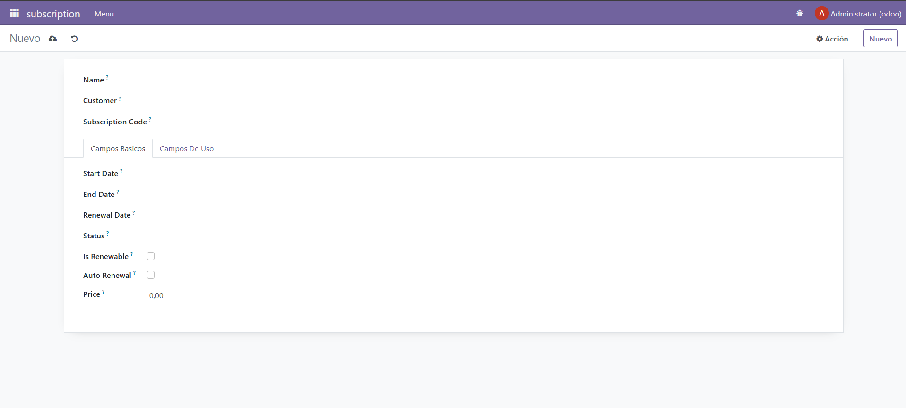

## [Unidad 6](../index.md)
# Practica 5

## Archivo manifest
```
# -*- coding: utf-8 -*-
{
    'name': "subscription",

    'summary': """
        Short (1 phrase/line) summary of the module's purpose, used as
        subtitle on modules listing or apps.openerp.com""",

    'description': """
        Long description of module's purpose
    """,

    'author': "Ivan",
    'website': "https://www.yourcompany.com",

    # Categories can be used to filter modules in modules listing
    # Check https://github.com/odoo/odoo/blob/16.0/odoo/addons/base/data/ir_module_category_data.xml
    # for the full list
    'category': 'Uncategorized',
    'version': '0.1',

    # any module necessary for this one to work correctly
    'depends': ['base'],

    # always loaded
    'data': [
        'security/ir.model.access.csv',
        'views/views.xml',
        'views/templates.xml',
    ],
    # only loaded in demonstration mode
    'demo': [
        'demo/demo.xml',
    ],
}
```

## Archivo security
```
id,name,model_id:id,group_id:id,perm_read,perm_write,perm_create,perm_unlink
access_subscription_subscription,subscription.subscription,model_subscription_subscription,base.group_user,1,1,1,1
```


## Archivo del modelo
```
# -*- coding: utf-8 -*-

from datetime import date, timedelta
from odoo import models, fields, api


class subscription(models.Model):
    _name = 'subscription.subscription'
    _description = 'subscription.subscription'

    name = fields.Char(required=True)
    customer_id = fields.Many2one(
        'res.partner',
        required=True
    )
    subscription_code = fields.Char(required=True)
    start_date = fields.Date(required=True)
    end_date = fields.Date()
    renewal_date = fields.Date()
    status = fields.Selection([
        ('active', 'Active'),
        ('expired', 'Expired'),
        ('pending', 'Pending'),
        ('cancelled', 'Cancelled')
    ])
    is_renewable = fields.Boolean()
    auto_renewal = fields.Boolean()
    price = fields.Float()
    usage_limit = fields.Integer()
    current_usage = fields.Integer()
    use_percent = fields.Float(compute="_value_porcentaje")
    relacion_metrica = fields.Many2one(comodel_name='subscription.metrica', inverse_name='relacion_suscripciones')

    @api.depends('usage_limit', 'current_usage')
    def _value_porcentaje(self):
        for record in self:
            if record.current_usage and record.current_usage > 0 and record.usage_limit and record.usage_limit > 0:
                record.use_percent = float((record.current_usage / record.usage_limit) * 100)
            else:
                record.use_percent = 0.0

    @api.depends('end_date')
    def action_anadir_quince_dias(self):
        for record in self:
            record.end_date = record.end_date + timedelta(days=15)

```

## Archivo de la vista
```
<odoo>
  <data>
    <!-- explicit list view definition -->

    <record model="ir.ui.view" id="subscription.basic">
      <field name="name">subscription basic</field>
      <field name="model">subscription.subscription</field>
      <field name="arch" type="xml">
        <tree decoration-danger="status=='expired'" decoration-warning="status=='cancelled'" limit="15">
          <field name="name" string="nombre"/>
          <field name="subscription_code" string="codigo subscripcion"/>
          <field name="start_date" string="fecha comienzo"/>
          <field name="end_date" string="fecha finalizacion" widget="remaining_days"/>
          <button name="action_anadir_quince_dias" type="object" string="15 dias mas" class="btn-primary" icon="fa-plus"/>
          <field name="renewal_date" string="renovacion"/>
          <field name="status" string="estado" widget="radio"/>
          <field name="is_renewable" string="es renovable"/>
          <field name="auto_renewal" string="renovacion automatica"/>
          <field name="price" string="precio" attrs="{'invisible': [('status', '=', 'cancelled')]}"/>
        </tree>
      </field>
    </record>

    <record model="ir.ui.view" id="subscription.usage">
      <field name="name">subscription usage</field>
      <field name="model">subscription.subscription</field>
      <field name="arch" type="xml">
        <tree decoration-danger="use_percent&gt;=80" limit="15">
          <field name="name" string="nombre"/>
          <field name="usage_limit" string="maximo de usos" widget="progressbar"/>
          <field name="current_usage" string="cantidad de usos"/>
          <field name="use_percent" string="porcentaje de usos" avg="1"/>
        </tree>
      </field>
    </record>

    <record model="ir.ui.view" id="subscription.formulario">
      <field name="name">subscription formulario</field>
      <field name="model">subscription.subscription</field>
      <field name="arch" type="xml">
        <form string="subscripciones">
        <sheet>
          <group>
              <field name="name"/>
              <field name="customer_id"/>
              <field name="subscription_code"/>
            </group>
            <notebook>
              <page name="basico" string="Campos Basicos">
                <group>
                  <field name="start_date"/>
                  <field name="end_date"/>
                  <field name="renewal_date"/>
                  <field name="status"/>
                  <field name="is_renewable"/>
                  <field name="auto_renewal"/>
                  <field name="price"/>
                </group>
              </page>
              <page name="uso" string="Campos De Uso">
                <group>
                  <field name="usage_limit"/>
                  <field name="current_usage"/>
                  <field name="use_percent"/>
                </group>
              </page>
            </notebook>
        </sheet>
        </form>
      </field>
    </record>

    <!-- actions opening views on models -->

    <record model="ir.actions.act_window" id="subscription.action_window_basic">
      <field name="name">suscripciones (Básico)</field>
      <field name="res_model">subscription.subscription</field>
      <field name="view_mode">tree,form</field>
      <field name="view_id" ref="subscription.basic"/>
    </record>

    <record model="ir.actions.act_window" id="subscription.action_window_usage">
      <field name="name">Suscripciones (Uso)</field>
      <field name="res_model">subscription.subscription</field>
      <field name="view_mode">tree,form</field>
      <field name="view_id" ref="subscription.usage"/>
    </record>

    <record model="ir.actions.act_window" id="subscription.action_window_form">
      <field name="name">Suscripciones (Formulario)</field>
      <field name="res_model">subscription.subscription</field>
      <field name="view_mode">tree,form</field>
      <field name="view_id" ref="subscription.formulario"/>
    </record>

    <record model="ir.actions.act_window" id="subscription.action_form_metrica">
      <field name="name">Metrica (Formulario)</field>
      <field name="res_model">subscription.metrica</field>
      <field name="view_mode">tree,form</field>
      <field name="view_id" ref="subscription.formulario_metrica"/>
    </record>

    <!-- Top menu item -->

    <menuitem name="subscription" id="subscription.menu_root"/>

    <!-- menu categories -->

    <menuitem name="Menu" id="subscription.menu_1" parent="subscription.menu_root"/>
    <!-- <menuitem name="Menu 2" id="subscription.menu_2" parent="subscription.menu_root"/> -->

    <!-- actions -->

    <menuitem name="Lista Basico" id="subscription.menu_1_list" parent="subscription.menu_1"
              action="subscription.action_window_basic"/>
    <menuitem name="Lista Uso" id="subscription.menu_2_list" parent="subscription.menu_1"
              action="subscription.action_window_usage"/>
    <menuitem name="Formulario" id="subscription.menu_3_form" parent="subscription.menu_1"
              action="subscription.action_window_form"/>

  </data>
</odoo>
```


## Prueba Funcionamiento
