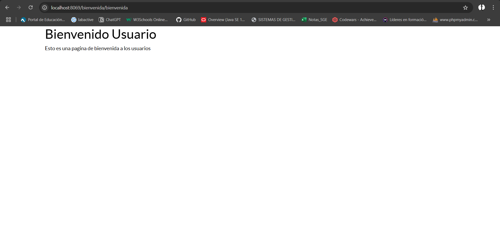
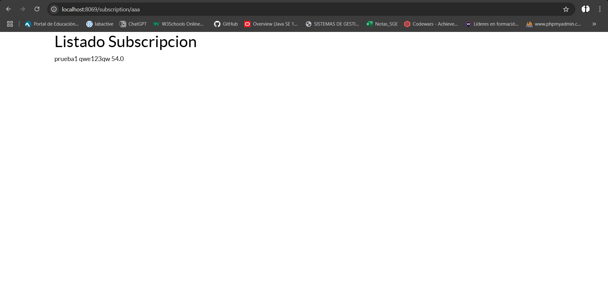

## [Unidad 6](../index.md)
# Practica 3

## Archivo manifest
```
# -*- coding: utf-8 -*-
{
    'name': "subscription",

    'summary': """
        Short (1 phrase/line) summary of the module's purpose, used as
        subtitle on modules listing or apps.openerp.com""",

    'description': """
        Long description of module's purpose
    """,

    'author': "Ivan",
    'website': "https://www.yourcompany.com",

    # Categories can be used to filter modules in modules listing
    # Check https://github.com/odoo/odoo/blob/16.0/odoo/addons/base/data/ir_module_category_data.xml
    # for the full list
    'category': 'Uncategorized',
    'version': '0.1',

    # any module necessary for this one to work correctly
    'depends': ['base'],

    # always loaded
    'data': [
        'security/ir.model.access.csv',
        'views/views.xml',
        'views/aaa.xml',
        'views/dinamic_web.xml',
        'views/static_web.xml',
        'views/templates.xml',
    ],
    # only loaded in demonstration mode
    'demo': [
        'demo/demo.xml',
    ],
}

```

## Archivo del pagina estatica
```
<odoo>
    <template id="static_web" name="Bienvenida">
        <t t-call="web.html_container">
            <div class="container">
                <h1>Bienvenido Usuario</h1>
                <p>Esto es una pagina de bienvenida a los usuarios</p>
            </div>
        </t>
    </template>
</odoo>
```

## Archivo de pagina dinamica
```
<odoo>
    <template id="aaa" name="aaa">
        <t t-call="web.html_container">
            <div class="container">
                <h1>Listado Subscripcion</h1>
                <t t-foreach="subscriptions" t-as="subscription">
                    <div class="subscription">
                        <span><t t-esc="subscription.name"/></span>
                        <span><t t-esc="subscription.subscription_code"/></span>
                        <span><t t-esc="subscription.price"/></span>
                    </div>
                </t>
            </div>
        </t>
    </template>
</odoo>
```

## Archivo controlador
```
# -*- coding: utf-8 -*-
from odoo import http
from odoo.http import request, Response
import json


class Subscription(http.Controller):
    @http.route('/bienvenida/bienvenida', type='http',auth='public', website=True)
    def pagina_estatica(self, **kwargs):
        return http.request.render('subscription.static_web', {})

    @http.route('/subscription/webdinamica', type='http', auth='public', website=True)
    def pagina_dinamica(self, **kwargs):
        subscriptions = request.env['subscription.subscription'].search([])
        return http.request.render('subscription.dinamic_web', {
            'subscriptions': subscriptions
        })

    @http.route('/subscription/aaa', type='http', auth='public', website=True)
    def pagina_dinamica(self, **kwargs):
        subscriptions = request.env['subscription.subscription'].search([])
        return http.request.render('subscription.aaa', {
            'subscriptions': subscriptions
        })
    
```


## Prueba Funcionamiento Estatica


## Prueba Funcionamiento Dinamica
