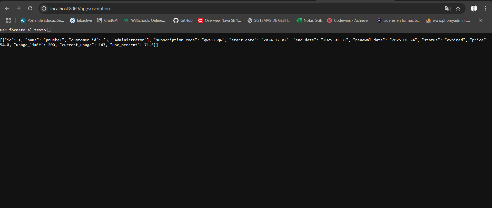
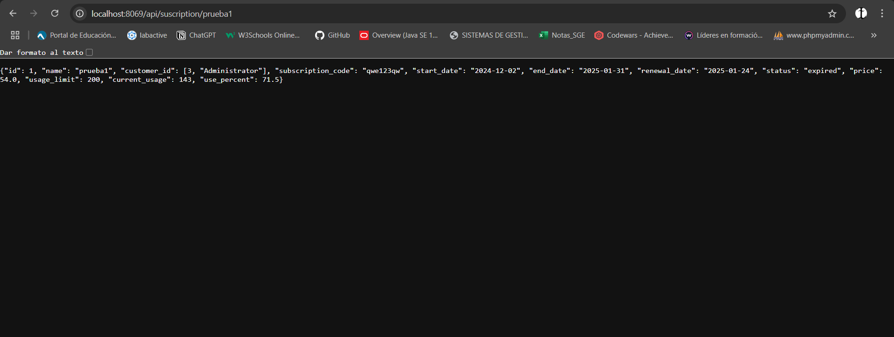

## [Unidad 7](../index.md)
# Practica 2

## Archivo Controlador
```
# -*- coding: utf-8 -*-
from odoo import http
from odoo.http import request, Response
import json


class Subscription(http.Controller):
    @http.route('/bienvenida/bienvenida', type='http',auth='public', website=True)
    def pagina_estatica(self, **kwargs):
        return http.request.render('subscription.static_web', {})

    @http.route('/subscription/webdinamica', type='http', auth='public', website=True)
    def pagina_dinamica(self, **kwargs):
        subscriptions = request.env['subscription.subscription'].search([])
        return http.request.render('subscription.dinamic_web', {
            'subscriptions': subscriptions
        })

    @http.route('/subscription/aaa', type='http', auth='public', website=True)
    def pagina_dinamica(self, **kwargs):
        subscriptions = request.env['subscription.subscription'].search([])
        return http.request.render('subscription.aaa', {
            'subscriptions': subscriptions
        })
    
    @http.route('/api/suscription', type='http', methods=['GET'], csrf=False)
    def api_subscripciones(self, **kwargs):
        try:
            status = request.params.get('status')
            valid_statuses = ['active', 'expired', 'pending', 'cancelled']
            if status and status not in valid_statuses:
                return Response(
                    json.dumps({"error": "estado erroneo, solo existen estos estados: active, expired, pending, cancelled."}),
                    content_type='application/json',
                    status=400
                )
            page = int(request.params.get('page', 1))  # Default a la página 1 si no se proporciona
            per_page = 10  # Número de registros por página
            offset = (page - 1) * per_page
            limit = per_page
            if status:
                subscriptions = request.env['subscription.subscription'].sudo().search([('status', '=', status)], limit=limit, offset=offset)
            else:
                subscriptions = request.env['subscription.subscription'].sudo().search([], limit=limit, offset=offset)
            subscriptions_data = []
            for sub in subscriptions:
                sub_data = sub.read(['id', 'name', 'customer_id', 'subscription_code', 'start_date', 'end_date', 'renewal_date', 'status', 'price', 'usage_limit', 'current_usage', 'use_percent'])
                for record in sub_data:
                    if record['start_date']:
                        record['start_date'] = record['start_date'].strftime('%Y-%m-%d')
                    if record['end_date']:
                        record['end_date'] = record['end_date'].strftime('%Y-%m-%d')
                    if record['renewal_date']:
                        record['renewal_date'] = record['renewal_date'].strftime('%Y-%m-%d')
                subscriptions_data.append(record)
            return Response(
                json.dumps(subscriptions_data),
                content_type='application/json',
                status=200
            )
        except Exception as e:
            return Response(
                json.dumps({"error": f"Internal server error: {str(e)}"}),
                content_type="application/json",
                status=500
            )
        
    @http.route('/api/suscription/<string:name>', type='http', methods=['GET'], csrf=False)
    def api_subscripciones_parametro(self, name):
        try:
            subscription = request.env['subscription.subscription'].sudo().search([('name', '=', name)], limit=1)
            if not subscription:
                return Response(
                    json.dumps({"error": f"Subscription with name '{name}' not found."}),
                    content_type='application/json',
                    status=404
                )
            subscription_data = subscription.read(['id', 'name', 'customer_id', 'subscription_code', 'start_date', 'end_date', 'renewal_date', 'status', 'price', 'usage_limit', 'current_usage', 'use_percent'])

            # Convertir las fechas a formato string
            for record in subscription_data:
                if record['start_date']:
                    record['start_date'] = record['start_date'].strftime('%Y-%m-%d')
                if record['end_date']:
                    record['end_date'] = record['end_date'].strftime('%Y-%m-%d')
                if record['renewal_date']:
                    record['renewal_date'] = record['renewal_date'].strftime('%Y-%m-%d')
            return Response(
                json.dumps(subscription_data[0]),
                content_type='application/json',
                status=200
            )
        except Exception as e:
            return Response(
                json.dumps({"error": f"Internal server error: {str(e)}"}),
                content_type="application/json",
                status=500
            )
        
```

## Prueba Funcionamiento API REST 1º


## Prueba Funcionamiento API REST 2º
